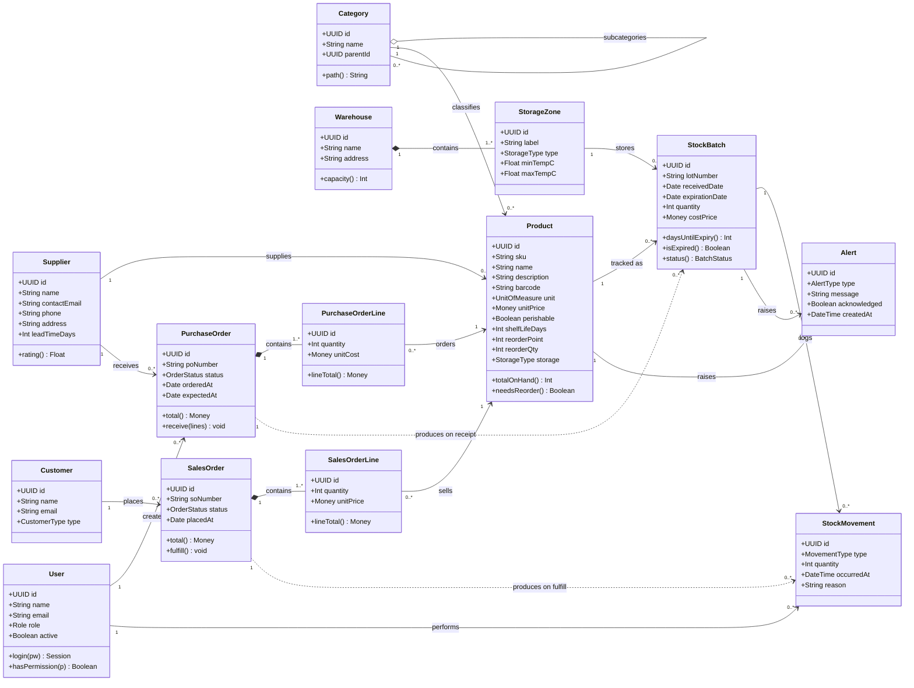
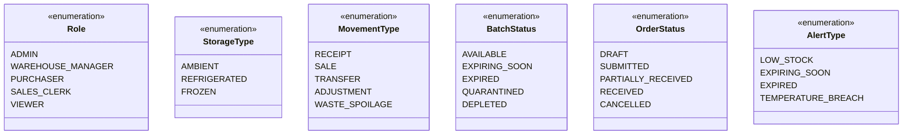

# FreshTrack — Food Inventory Management

UML domain model for **FreshTrack**, an inventory management system for a company
that sells food and food supplies. Food adds two concerns that generic inventory
systems ignore: **lot/batch traceability** and **expiration dates**. The model
below treats those as first-class.

## Class diagram

## Enumerations

## Key design decisions

- **Batch / lot tracking** — quantity lives on `StockBatch`, not `Product`. A
  product's on-hand total is the sum of its non-depleted batches. This is what
  enables expiry tracking, FEFO picking (First-Expired-First-Out), and recall
  traceability back to a supplier lot.
- **StockMovement as an immutable ledger** — every quantity change (receipt,
  sale, transfer, adjustment, spoilage) is an append-only event. Current stock is
  derivable from the ledger, which gives a full audit trail and explains *why*
  stock changed.
- **Storage zones with temperature ranges** — perishable goods must land in a
  zone whose `StorageType` matches the product. A breach raises a
  `TEMPERATURE_BREACH` alert.
- **Alerts** are generated for low stock (`onHand < reorderPoint`), near-expiry
  batches, and expired stock, driving the daily operational dashboard.
- **Orders produce inventory events** — receiving a `PurchaseOrder` creates
  `StockBatch` rows; fulfilling a `SalesOrder` consumes batches FEFO and writes
  `SALE` movements.
